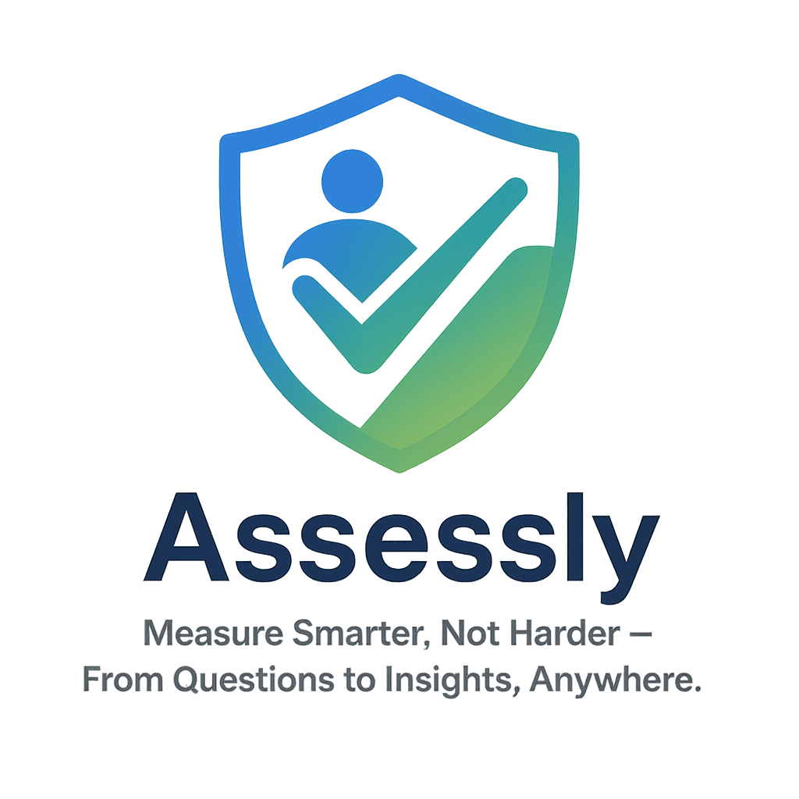

# Assessly SaaS Platform



Measure Smarter, Not Harder – From Questions to Insights, Anywhere.

A modern SaaS assessment platform designed for organizations, HR teams, educational institutions, and any entity requiring robust assessment solutions. Whether you need to conduct exams, field questionnaires, or performance evaluations, our platform provides the tools for seamless assessment creation, distribution, and analysis.

## 🔥 Key Features

### 👨‍💻 Role-Based Access Control
- **Admin**: Full system control and configuration
- **Assessor**: Create and manage assessments, view results
- **Candidate**: Complete assigned assessments

### 📝 Advanced Assessment Builder
- Multiple question types:
  - Text responses
  - Single/multiple choice
  - File uploads
  - Rating scales
- Flexible assessment templates
- Question branching logic

### 📊 Comprehensive Reporting
- Automated PDF report generation
- Customizable report templates
- Individual and group performance analytics

### 🌐 Offline Capabilities
- Complete assessments without internet
- Automatic sync when connection restored
- Data integrity protection

### 📈 Analytics Dashboard
- Real-time response tracking
- Performance metrics
- Completion rate statistics
- Exportable data for further analysis

## 🚀 Hosting & Infrastructure
- **Primary Hosting**: Firebase Hosting
- **Database**: Firebase Firestore (NoSQL)
- **Authentication**: Firebase Auth
- **File Storage**: Firebase Storage

## 🛠 Getting Started

### Prerequisites
- Node.js (v14 or later)
- Firebase CLI
- Google account for Firebase configuration

### Installation
1. Clone the repository:
   ```bash
   git clone https://github.com/your-repo/assessment-platform.git
